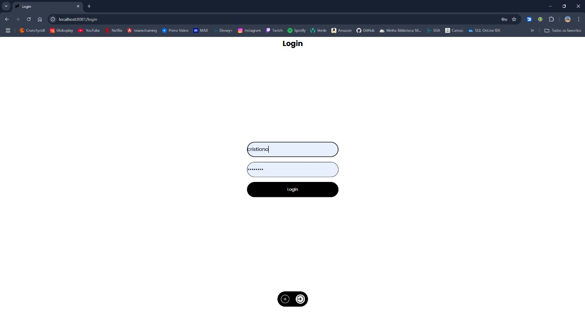
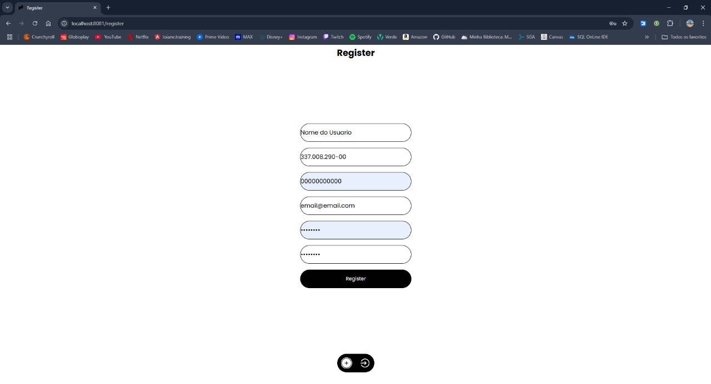
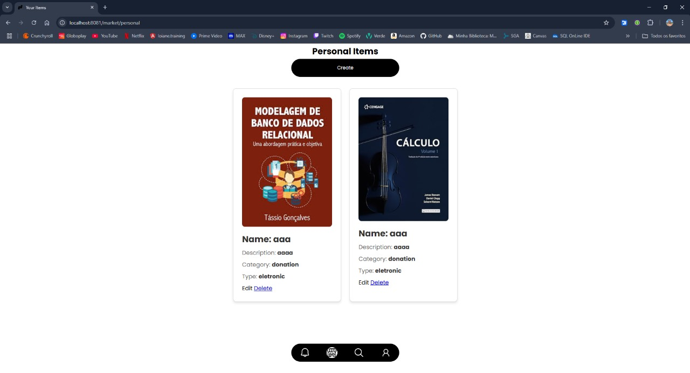
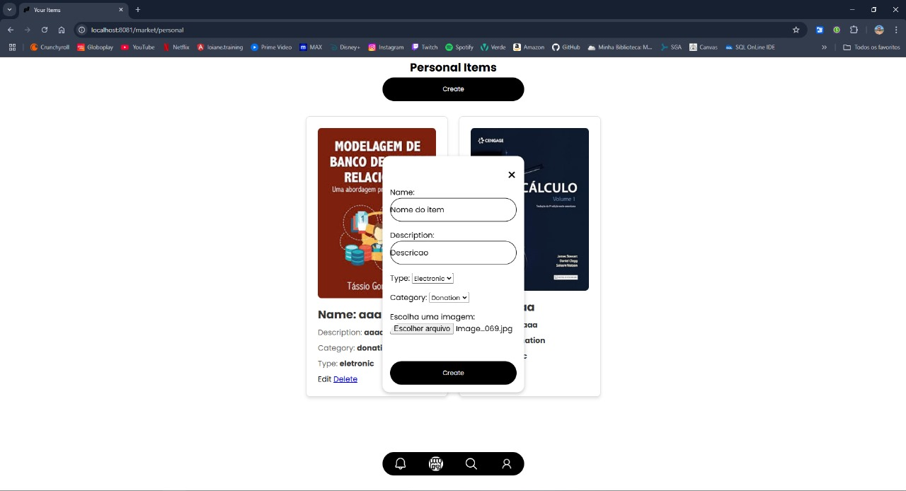
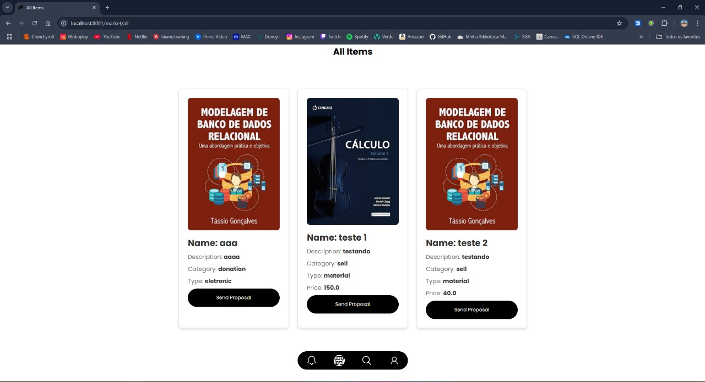
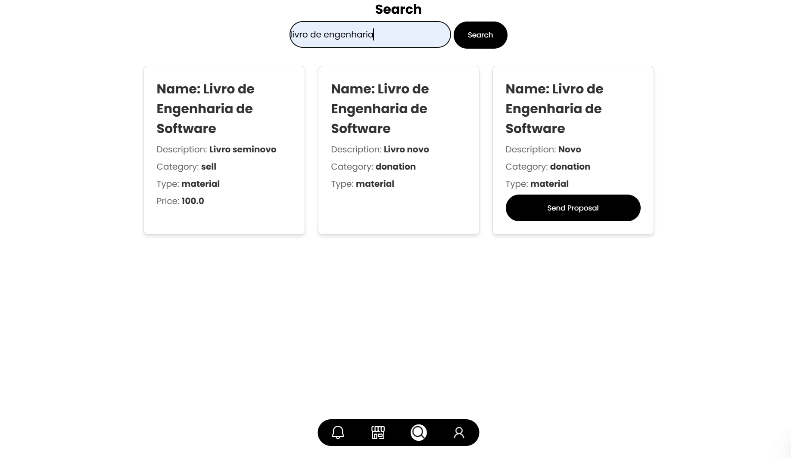
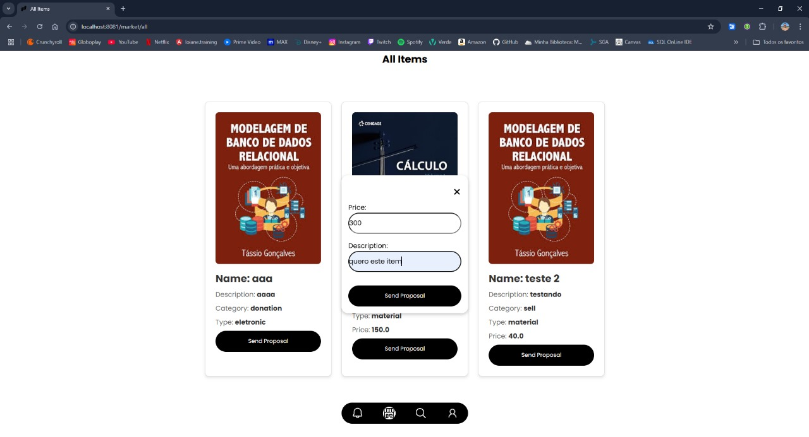
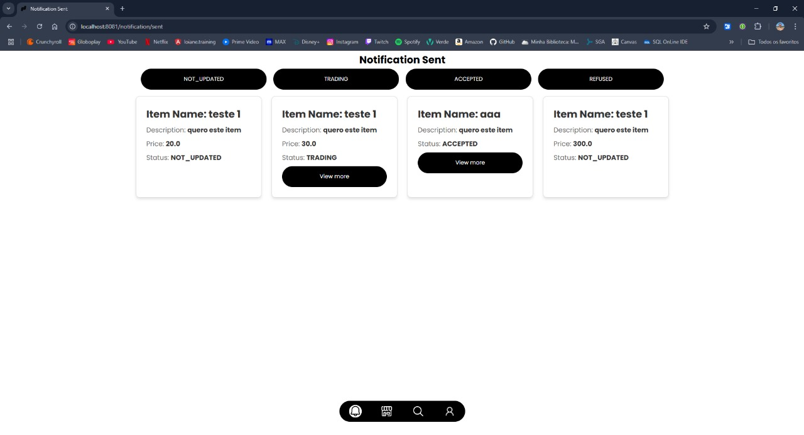
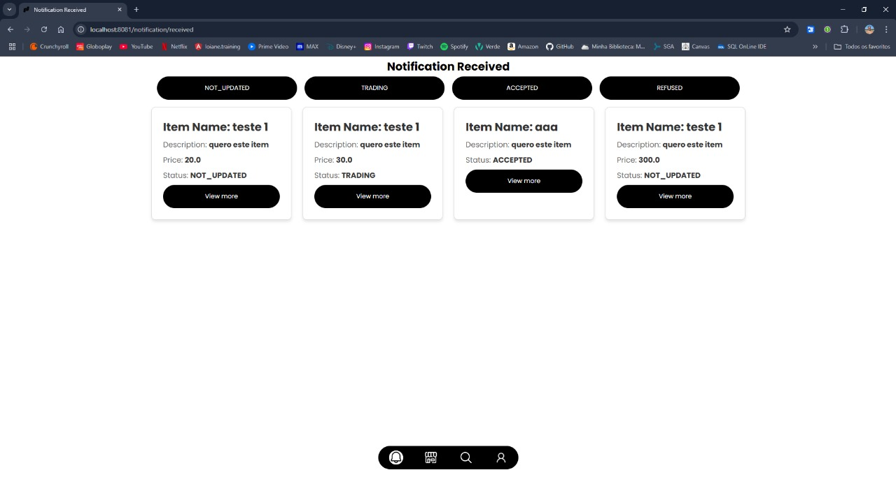

## 6. Interface do sistema

_Visão geral da interação do usuário por meio das telas do sistema. Apresente as principais interfaces da plataforma._

## 6.1. Tela principal do sistema

A tela inicial do sistema é a de "Login", que serve como ponto de entrada para o usuário acessar todas as funcionalidades disponíveis na plataforma.

## 6.2. Telas do processo 1 - Gerenciamento de Usuário

O processo de Gerenciamento de Usuários oferece duas opções principais: Login e Cadastro. Se o usuário já estiver registrado no sistema, basta preencher os campos de login e clicar no botão "Login". Caso contrário, é possível realizar o cadastro clicando no botão "+" para criar uma nova conta.

Se o usuário ainda não possuir cadastro, será necessário preencher um formulário com suas informações. Após o envio, o sistema realizará a validação dos dados fornecidos. Caso estejam corretos, eles serão armazenados no banco de dados, e o usuário receberá uma confirmação de cadastro. Em caso de erro, o sistema exibirá uma mensagem com orientações para as correções necessárias.

## 6.3. Telas do processo 2 - Gerenciamento de Item

O processo de Gerenciamento de Itens é composto por uma sequência de atividades bem definidas. Inicialmente, essa tela exibe todos os itens que o usuário já cadastrou em seu perfil para venda, troca ou doação.

Para cadastrar e disponibilizar um novo item no sistema, o usuário fornece os detalhes do item, envia imagens e aguarda a validação das informações pelo sistema. Se os dados forem validados corretamente, o item é armazenado, publicado e o usuário recebe uma mensagem de confirmação. Caso contrário, o processo é interrompido, e o sistema orienta o usuário sobre as correções necessárias.

## 6.4. Telas do processo 3 - Busca e Solicitação de Item

O processo de Modelagem de Busca e Solicitação de Itens começa com o usuário tendo acesso a uma tela que exibe todos os itens disponíveis no sistema.

O usuário pode filtrar os itens utilizando a barra de pesquisa, inserindo uma palavra-chave relacionada ao produto que deseja adquirir.

Por fim, o usuário pode fazer uma proposta ao proprietário do item de seu interesse. Ele seleciona um item na lista de resultados, escolhe o tipo de solicitação (compra, troca ou doação), define a quantidade e envia a proposta, concluindo assim o processo.

## 6.5. Telas do processo 4 - Proposta entre Usuários

O processo de Proposta entre Usuários ocorre quando um interessado visualiza um produto no sistema e deseja fazer uma oferta ao proprietário do item (vendedor).

O sistema facilita a comunicação indireta, notificando o vendedor sobre a proposta e fornecendo as informações de contato do interessado. A negociação, entretanto, é realizada fora do sistema, por telefone ou outro meio de comunicação.

