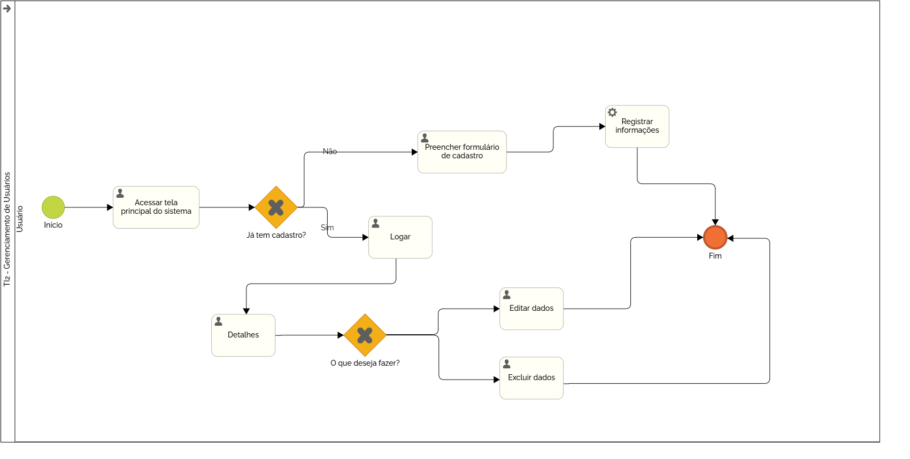

### 3.3.1 Processo 1 – Gerenciamento de Usuário

O processo de Gerenciamento de Usuários começa com o acesso à tela inicial do sistema, onde o usuário encontra as opções Registrar, caso não seja cadastrado ainda, e Entrar, caso já tenha cadastro. Caso não tenha cadastro, ele deve preencher um formulário com seus dados. Após enviar as informações, o sistema as valida e, se corretas, armazena no banco de dados. O usuário recebe uma confirmação do cadastro, ou, em caso de erro, uma mensagem orientando sobre as correções necessárias.

Modelo BPMN do Processo 1.

#### Detalhamento das atividades

1. **Acessar a tela principal do sistema**  
   O usuário inicia o processo acessando a tela inicial do sistema. Nesta interface, ele encontra as opções Registrar, se ainda não tiver cadastro, e Entrar, caso já tenha cadastro.

   - **Comando:** Acessar a tela de gerenciamento e escolher entre cadastrar ou logar.

---

2. **Decisão: Já tem cadastro?**  
   O usuário verifica se já possui cadastro. Se sim, ele escolhe a opção que o leva à tela de login. Caso contrário, ele escolhe a opção da tela de cadastro.

   - **Comando:** Selecionar "Registrar" ou "Entrar".

---

3. **Preencher formulário de cadastro (Se o usuário não tem cadastro)**  
   O usuário insere as informações solicitadas nos campos apropriados do formulário de cadastro, como nome, telefone, CPF, e-mail, senha e confirmar senha.

   - **Comandos:** Preencher os campos de cadastro.

---

4. **Submeter informações de cadastro**
   Após preencher o formulário, o usuário clica no botão de registrar, enviando as informações para o sistema, que realiza o cadastro, logando-o automaticamente, ou indica os campos com erros.
   
   - **Comando:** Submeter o formulário para registrar o usuário.

---

5. **Preencher formulário de login (Se o usuário já tem cadastro)**  
   O usuário insere seu e-mail e senha nos campos de login.
   
   - **Comando:** Preencher os campos de e-mail e senha para login.

---

6. **Submeter informações de login**  
   O usuário clica no botão de login, enviando os dados para o sistema, que realiza o login ou indica os campos com erros.

   - **Comando:** Submeter o formulário para realizar o login.
     
---

7. **Validações de dados**  
   O sistema verifica os dados submetidos para garantir que estão completos e atendem aos requisitos, como formato de e-mail, correspondência da senha com a confirmação, e inexistência de outro usuário com o mesmo e-mail ou CPF.
   
   - **Comando:** Nenhum comando. O sistema valida os dados.

---

8. **Feedback de validações**  
  Caso algum erro seja encontrado, o sistema exibe o formulário novamente, com as mensagens de erro apresentadas abaixo dos campos problemáticos para facilitar a correção.
   
   - **Comando:** Exibir os erros de validação no formulário.

---

9. **Armazenamento de dados**  
   Se as validações forem bem-sucedidas, o sistema armazena os dados na base, permitindo a recuperação futura das informações.
   
   - **Comando:** Armazenar os dados do usuário na base de dados.
  
---

**Cadastrar usuário**

| **Campo**           | **Tipo**       | **Restrições**                                                                        | **Valor default** |
|:--------------------|----------------|---------------------------------------------------------------------------------------|------------------:|
| Nome do usuário     | Caixa de Texto | Não pode estar vazio, deve ter entre 1 e 30 caracteres.                               |              null |
| Telefone do usuário | Caixa de Texto | Não pode estar vazio, deve ter entre 10 e 17 caracteres.                              |              null |
| Email do usuário    | Caixa de Texto | Não pode estar vazio, tem que ter @, e não pode ser duplicado.                        |              null |
| CPF                 | Caixa de Texto | Não pode estar vazio, tem que ter entre 11 e 14 caracteres, e não pode ser duplicado. |              null |
| Senha do usuário    | Caixa de Texto | Não pode estar vazio.                                                                 |              null |
| Confirmar senha     | Caixa de Texto | Precisa ser preenchido igual ao campo "Senha do usuário".                             |              null |

| **Comandos** | **Destino**     | **Tipo** |
|:-------------|-----------------|---------:|
| Registrar    | Fim do processo |   submit |
| Entrar       | Tela de login   |     link |

---

**Logar usuário**

| **Campo**           | **Tipo**       | **Restrições**                                                | **Valor default** |
|:--------------------|----------------|---------------------------------------------------------------|------------------:|
| Email do usuário    | Caixa de Texto | Não pode estar vazio, tem que ter @, e deve estar cadastrado. |              null |
| Senha do usuário    | Caixa de Texto | Não pode estar vazio, tem que ser igual a cadastrada.         |              null |

| **Comandos** | **Destino**     |  **Tipo** |
|:-------------|-----------------|----------:| 
| Logar        | Fim do processo |    submit |

---

**Editar dados do usuário**

| **Campo**           | **Tipo**       | **Restrições**                                                                        | **Valor default** |
|:--------------------|----------------|---------------------------------------------------------------------------------------|------------------:|
| Nome do usuário     | Caixa de Texto | Não pode estar vazio, deve ter entre 1 e 30 caracteres.                               |              null |
| Telefone do usuário | Caixa de Texto | Não pode estar vazio, deve ter entre 10 e 17 caracteres.                              |              null |
| Email do usuário    | Caixa de Texto | Não pode estar vazio, tem que ter @, e não pode ser duplicado.                        |              null |
| CPF                 | Caixa de Texto | Não pode estar vazio, tem que ter entre 11 e 14 caracteres, e não pode ser duplicado. |              null |
| Senha do usuário    | Caixa de Texto | Não pode estar vazio.                                                                 |              null |
| Confirmar senha     | Caixa de Texto | Precisa ser preenchido igual ao campo "Senha do usuário".                             |              null |

| **Comandos** | **Destino**     | **Tipo** |
|:-------------|-----------------|---------:|
| Registrar    | Fim do processo |   submit |
| Entrar       | Tela de login   |     link |

---

**Excluir usuário**

| Campo                | Tipo            | Restrições               | Valor default    |
|----------------------|-----------------|--------------------------|------------------|
| Excluir              | Botão           | Sim / Não                |                  |

| Comandos             | Destino                                | Tipo             |
|----------------------|----------------------------------------|------------------|
| Sim                  | Usuário será excluido.                 | default          |
| Não                  | Usuário não será excluido.             | default          |

