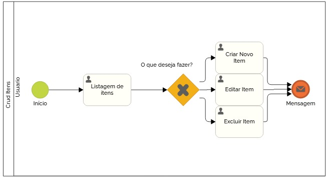

### 3.3.2 Processo 2 – Gerenciamento de Item

O processo de Gerenciamento de Item segue uma sequência de atividades onde o usuário insere detalhes sobre o item, envia imagens, e o sistema valida as informações. Caso as informações sejam válidas, o item é armazenado e publicado, e o usuário recebe uma mensagem de confirmação. Se as informações não forem válidas, o processo é encerrado.

Modelo BPMN do Processo 2.

#### Detalhamento das atividades

1. **Criar ou Editar item**  
   O usuário insere todos os detalhes necessários sobre o item que deseja cadastrar no sistema. Para prosseguir, todos os campos obrigatórios devem ser preenchidos.

Campos:
- Nome do Item: Campo obrigatório. O usuário deve inserir o nome do item. Este campo não pode ficar vazio.
- Descrição do Item: Campo obrigatório. O usuário descreve o item, com mínimo de 20 caracteres.
- Categoria: Campo opcional. Permite ao usuário selecionar uma categoria para o item (ex.: Eletrônico, Material Escolar).
- Tipo do Anúncio: Campo opcional. O usuário pode definir o item como "Venda", "Troca" ou "Doação".
- Imagens do Item: O usuário deve enviar uma imagem principal e pode adicionar até 5 imagens adicionais.

   - **Comandos:** Submeter: Avança para a etapa de revisão e confirmação. / Cancelar: Interrompe o processo de cadastro do item.
     
---

2. **Confirmar informações**  
   O usuário revisa todos os dados inseridos sobre o item, incluindo os detalhes e imagens, para garantir a exatidão antes de confirmar o cadastro.

Visualização: 
- Detalhes: Campos preenchidos previamente (nome, descrição, categoria etc.) são exibidos para revisão.
- Imagens: As imagens do item são exibidas para confirmação.

   - **Comandos:** Confirmar: Finaliza o cadastro e envia o item para publicação. / Voltar para Correção: Retorna para a etapa anterior para ajustes.
     
---

3. **Mensagem de confirmação**  
  Após a confirmação das informações, o item é publicado no sistema, e o usuário recebe uma mensagem informando o sucesso do cadastro.

Notificação:
- Mensagem de Confirmação: Informa que o item foi cadastrado e publicado com sucesso.

   - **Comandos:** Fechar: Encerra o processo e fecha a interface.

---

**Criar novo item**

| **Campo**            | **Tipo**         | **Restrições**                               | **Valor default**     |
| ---                  | ---              | ---                                          | ---                   |
| Nome do item         | Caixa de Texto   | Não pode estar vazio                         | null                  |
| Descrição do item    | Área de texto    | mínimo de 20 caracteres                      | null                  |
| Categoria            | Seleção única    | Opcional: Eletrônico, Material escolar, etc. | null                  |
| Tipo do anúncio      | Seleção única    | Opcional: Compra, venda ou doação            | null                  |
| Preço                | Caixa de Texto   | Não pode estar vazio                         | null                  |
| Imagem               | Imagem           | Adicionar no mínimo 1 e no máximo 5 imagens. | null                  |

| **Comandos**         |  **Destino**                                    | **Tipo** |
| ---                  | ---                                             | ---      | 
| Submeter detalhes    | Próxima atividade (Submeter imagens do item)    | default  |
| Cancelar             | Cancela o cadastro                              | cancel   |

---

**Editar item**

| **Campo**            | **Tipo**         | **Restrições**                               | **Valor default**     |
| ---                  | ---              | ---                                          | ---                   |
| Nome do item         | Caixa de Texto   | Não pode estar vazio                         | null                  |
| Descrição do item    | Área de texto    | mínimo de 20 caracteres                      | null                  |
| Categoria            | Seleção única    | Opcional: Eletrônico, Material escolar, etc. | null                  |
| Tipo do anúncio      | Seleção única    | Opcional: Compra, venda ou doação            | null                  |
| Preço                | Caixa de Texto   | Não pode estar vazio                         | null                  |
| Imagem               | Imagem           | Adicionar no mínimo 1 e no máximo 5 imagens. | null                  |

| **Comandos**         |  **Destino**                                    | **Tipo** |
| ---                  | ---                                             | ---      | 
| Submeter detalhes    | Próxima atividade (Submeter imagens do item)    | default  |
| Cancelar             | Cancela o cadastro                              | cancel   |

---

**Excluir item**

| Campo                | Tipo            | Restrições               | Valor default    |
|----------------------|-----------------|--------------------------|------------------|
| Excluir              | Botão           | Sim / Não                |                  |

| Comandos             | Destino                                | Tipo             |
|----------------------|----------------------------------------|------------------|
| Sim                  | Usuário será excluido.                 | default          |
| Não                  | Usuário não será excluido.             | default          |

---

**Mensagem de confirmação**

| **Campo**                     | **Tipo**         | **Restrições**                                               | **Valor default** |
| ---                           | ---              | ---                                                          | ---               |
| Texto de confirmação          | Área de texto    | Texto padrão informando que o item foi publicado com sucesso |                   |

| **Comandos**         |  **Destino**        | **Tipo** |
| ---                  | ---                 | ---      |
| Fechar               | Fim do processo     | default  |
