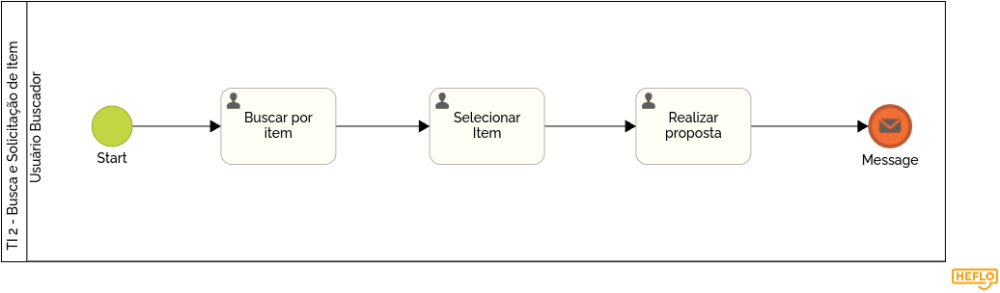

### 3.3.3 Processo 3 – Modelagem Busca e Solicitação de Item

O processo de Modelagem de Busca e Solicitação de Item começa com a pesquisa por palavra-chave. O usuário seleciona um item da lista de resultados e, em seguida, escolhe o tipo de solicitação (compra, troca ou doação), define a quantidade e envia a solicitação, concluindo o processo.

Modelo BPMN do Processo 3.

#### Detalhamento das atividades

1. **Buscar por item**  
   O usuário inicia o processo de busca utilizando uma palavra-chave para localizar itens de interesse.

Campo:
- Palavra-chave: O usuário insere um termo com no mínimo três caracteres para garantir especificidade na busca.

   - **Comando:** Pesquisar: Direciona o usuário para a etapa de Selecionar item, onde os resultados da busca são exibidos.

---

2. **Selecionar item**  
  Após a busca, o sistema exibe uma lista de itens relacionados à palavra-chave inserida. O usuário escolhe um item da lista para prosseguir.

Campo:
- Lista de Itens: Exibe os itens retornados pela busca. O usuário pode selecionar apenas um item.

   - **Comando:** Selecionar: Confirma a escolha e direciona o usuário para a próxima etapa, Solicitar Compra/Troca/Doação.

---

3. **Realizar Proposta (Solicitar Compra/Troca/Doação)**  
  Nesta etapa, o usuário formaliza a solicitação para o item selecionado, elaborando uma proposta e enviando ao dono do item.
  
   - **Comando:** Enviar Solicitação: Finaliza o processo e envia os dados ao sistema, concluindo a solicitação do item.

---

**Buscar por item**

| **Campo**               | **Tipo**         | **Restrições**         | **Valor default** |
| ---                     | ---              | ---                    | ---               |
| Palavra-chave           | Caixa de Texto   | mínimo de 3 caracteres |                   |

| **Comandos**         |  **Destino**                   | **Tipo**                 |
| ---                  | ---                            | ---                      |
| Pesquisar            | Selecionar item                | Default                  |

---

**Selecionar item**

| **Campo**       | **Tipo**         | **Restrições**                      | **Valor default** |
| ---             | ---              | ---                                 | ---               |
| Lista de Itens  |  Seleção Única   | Deve conter itens da busca          |                   |

| **Comandos**         | **Destino**                      | **Tipo**          |
| ---                  | ---                              | ---               |
| Selecionar           | Solicitar Compra/Troca/Doação    | Default           |

---

**Realizar Proposta (Solicitar Compra/Troca/Doação)**

| **Campo**            | **Tipo**         | **Restrições**                            | **Valor default**  |
| ---                  | ---              | ---                                       | ---                |
| Digite sua proposta  |  Caixa de Texto  | Não pode estar vazio.                     | Troca/Venda/Doação |

---

| **Comandos**         | **Destino**                      | **Tipo**          |
| ---                  | ---                              | ---               |
| Enviar Proposta      | Fim do Processo                  | Default           |
