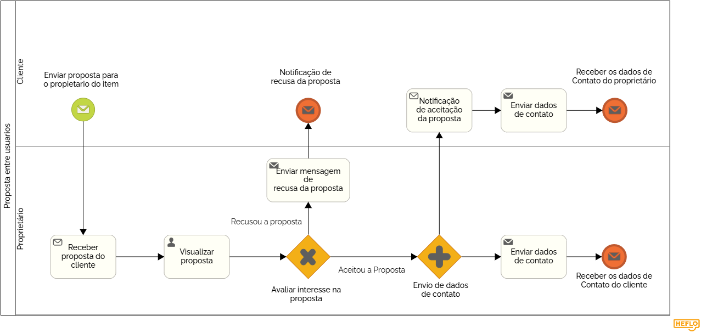

### 3.3.4 Processo 4 – Proposta entre Usuários

O processo de Proposta entre Usuários ocorre quando um Interessado visualiza um produto no sistema e deseja fazer uma proposta ao dono do item (Vendedor). O sistema facilita a comunicação indireta, notificando o Vendedor com a proposta e informações de contato do Interessado. A negociação é realizada externamente, por telefone ou outro meio de comunicação.

  
Modelo BPMN do Processo 4.

#### Detalhamento das Atividades

1. Enviar proposta para o proprietário do item  
O cliente inicia o processo enviando uma proposta para o proprietário do item por meio do sistema.

   - **Comando:** Enviar proposta.

---

2. Receber proposta do cliente  
O proprietário recebe uma notificação sobre a proposta enviada pelo cliente.  

   - **Comando:** Nenhum comando é necessário; o sistema registra a proposta automaticamente.  

---

3. Visualizar proposta  
O proprietário visualiza os detalhes da proposta para análise.  

   - **Comando:** Visualizar proposta.  

---

4. Avaliar interesse na proposta  
O proprietário avalia se aceita ou recusa a proposta recebida.  

   - **Comandos:**  
     - Sim (aceitar a proposta)  
     - Não (recusar a proposta)  

---

5. a) Enviar dados de contato (Se a proposta foi aceita)  
Se o proprietário aceitar a proposta, o sistema envia automaticamente os dados de contato do proprietário ao cliente.  

   - **Comando:** Enviar dados de contato.  

---

6. a) Receber dados de contato do proprietário  
O cliente recebe os dados de contato do proprietário para continuar a negociação fora do sistema.  

   - **Comando:** Nenhum comando é necessário.  

---

5. b) Enviar mensagem de recusa (Se a proposta foi rejeitada)  
Se o proprietário recusar a proposta, o sistema envia uma mensagem automática ao cliente informando a recusa.  

   - **Comando:** Enviar mensagem de recusa.  

---

6. b) Receber notificação de recusa  
O cliente é notificado sobre a recusa da proposta.  

   - **Comando:** Nenhum comando é necessário.  

---

Enviar proposta para o proprietário do item

| **Campo**    | **Tipo** | **Restrições**           | **Valor default**      |
|--------------|----------|--------------------------|------------------------|
| Descrição    | Texto    | Não pode estar vazio     | Descrição da proposta  |
| Valor        | Número   | Deve ser positivo        | -                      |

| **Comando**         | **Destino**                                 | **Tipo** |
|---------------------|---------------------------------------------|----------|
| Enviar proposta     | Próxima atividade (Receber proposta do cliente) | default  |

---

Receber proposta do cliente  

| **Campo**     | **Tipo** | **Restrições**           | **Valor default**      |
|---------------|----------|--------------------------|------------------------|
| Notificação   | Texto    | Não pode estar vazio     | Proposta recebida      |

| **Comando**    | **Destino**                                | **Tipo** |
|----------------|--------------------------------------------|----------|
| Nenhum         | Próxima atividade (Visualizar proposta)    | default  |

---

Visualizar proposta  

| **Campo**     | **Tipo** | **Restrições**           | **Valor default**      |
|---------------|----------|--------------------------|------------------------|
| Proposta      | Texto    | Não pode estar vazio     | Proposta recebida      |

| **Comando**          | **Destino**                              | **Tipo** |
|----------------------|------------------------------------------|----------|
| Visualizar proposta  | Próxima atividade (Avaliar interesse na proposta) | default  |

---

**Analisar a proposta**

| **Campo**      | **Tipo**         | **Restrições**            | **Valor Default**         |
|-----------------|------------------|---------------------------|---------------------------|
| Proposta        | Seleção Única    | Aceitar/Recusar           | Proposta recebida         |

| **Comandos**         | **Destino**                     | **Tipo**    |
|----------------------|---------------------------------|-------------|
| Analisar Proposta    | Próxima atividade (Decisão: Aceitar?) | Default     |

---

**Decisão: Aceitar a proposta?**

| **Campo**      | **Tipo**         | **Restrições**            | **Valor Default**         |
|-----------------|------------------|---------------------------|---------------------------|
| Aceitação       | Seleção Única    | Sim/Não                   |                           |

| **Comandos**    | **Destino**                          | **Tipo**    |
|------------------|-------------------------------------|-------------|
| Sim              | Próxima atividade (Combinar Entrega/Troca) | Default     |
| Não              | Próxima atividade (Notificação de Recusa) | Default     |

---

**Combinar entrega/troca**

| **Campo**              | **Tipo**         | **Restrições**            | **Valor Default**         |
|-------------------------|------------------|---------------------------|---------------------------|
| Detalhes da Entrega     | Texto            | Não pode estar vazio      |                           |

| **Comandos**           | **Destino**                     | **Tipo**    |
|-------------------------|---------------------------------|-------------|
| Confirmar Entrega       | Próxima atividade (Confirmar no Sistema) | Default     |

---

**Confirmar no sistema**

| **Campo**       | **Tipo**         | **Restrições**            | **Valor Default**         |
|------------------|------------------|---------------------------|---------------------------|
| Confirmação      | Texto            | Não pode estar vazio      | Detalhes confirmados      |

| **Comandos**               | **Destino**                     | **Tipo**    |
|----------------------------|---------------------------------|-------------|
| Confirmar no Sistema       | Próxima atividade (Notificação de Aceite) | Default     |

---

**Notificação de aceite**

| **Campo**       | **Tipo**         | **Restrições**            | **Valor Default**                  |
|------------------|------------------|---------------------------|------------------------------------|
| Notificação      | Texto            | Não pode estar vazio      | Notificação de aceite enviada      |

| **Comandos**    | **Destino**     | **Tipo**    |
|------------------|----------------|-------------|
| Notificar        | Fim do processo | Default     |

---

**Notificação de recusa**

| **Campo**       | **Tipo**         | **Restrições**            | **Valor Default**                  |
|------------------|------------------|---------------------------|------------------------------------|
| Notificação      | Texto            | Não pode estar vazio      | Notificação de recusa enviada      |

| **Comandos**    | **Destino**     | **Tipo**    |
|------------------|----------------|-------------|
| Notificar        | Fim do processo | Default     |
